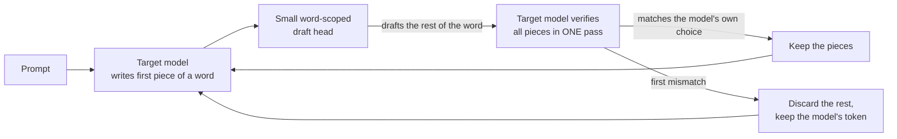

<div align="center">

# TokenLift

### Exploiting Latent Word Plans for Exact Word-Level Speculative Decoding in Byte-BPE Indic Language Models

**Faster Tamil and Hindi text generation, with output identical to the model's own.**

[](LICENSE)


[Quick start](#quick-start) · [The idea](#the-idea-in-two-minutes) · [Results](#results) · [Tool guide](tokenlift/README.md) · [Reproduce](#reproduce-the-paper) · [Cite](#citation)

</div>

---

## Why this exists

Large language models read text as *tokens*. For English a token is usually a whole word. For Tamil
and Hindi, a byte-level BPE tokenizer such as Qwen3's cuts one word into many small pieces:

| | Tokens per word | Share of a word's information in its first token |
| --- | ---: | ---: |
| English | 1.14 | 94.7% |
| Hindi | 4.82 | 24.9% |
| Tamil | **9.59** | **7.7%** |

A Tamil word is about nine model steps long, and most of those steps are just *spelling out* a
word the model has probably already settled on. Every step costs a full forward pass.

TokenLift asks three questions:

1. **Does the model know the word before it writes it?** (probing)
2. **Is that knowledge actually what drives the spelling?** (activation patching and attention knockout)
3. **Can we use it to generate faster without changing a single output token?** (a lossless speculative decoder)

## The idea in two minutes



* A tiny **EAGLE-style head** looks at the target model's hidden state and drafts the remaining
  pieces of the current word.
* The target model checks the whole draft in a single forward pass and keeps only what it would
  have produced itself. A wrong draft costs a little time, never correctness.
* Because only the target model's own choices are kept, greedy output matches plain greedy
  decoding (see [Exactness](#exactness)). With `temperature > 0` the standard speculative-sampling
  accept/reject rule preserves the target's sampling distribution.

## Quick start

```bash
git clone https://github.com/rochitl72/research-paper.git
cd research-paper
python3.11 -m venv venv && source venv/bin/activate
pip install -e ".[dev]"
pytest                      # 27 tests
```

```python
from tokenlift import TokenLift

spec = TokenLift.from_pretrained("Qwen/Qwen3-0.6B-Base", dtype="float32")

spec.fit(langs=["ta"], epochs=30)            # train a small word head (one time)
spec.save_head("ta", "head_ta.pt")

out = spec.generate("தமிழ்நாட்டின் தலைநகரம்", max_new=64, lang="ta")
print(out["text"])
```

Or from the command line:

```bash
# How much of this model's output in this language is spelling? (no training needed)
tokenlift report --model Qwen/Qwen3-0.6B-Base --text-file samples_ta.txt

# Generate with a trained head
tokenlift gen --model Qwen/Qwen3-0.6B-Base --lang ta --head head_ta.pt \
              --prompt "தமிழ்நாட்டின் தலைநகரம்"
```

The full API, sampling mode and saved-head format are in [`tokenlift/README.md`](tokenlift/README.md).

## Results

All on Qwen3-0.6B-Base, Tamil and Hindi Wikipedia, on a MacBook M1 Pro (16 GB).

| | Tamil | Hindi | English |
| --- | ---: | ---: | ---: |
| Tokens per word | 9.59 | 4.82 | 1.14 |
| Share of a word's information in its first token | 7.7% | 24.9% | 94.7% |
| Continuation tokens the model gets right greedily | 63.1% | 65.6% | 70.6% |
| Probe picks the upcoming word before it is written (1,000 candidates) | 14.5% | 39.8% | n/a |
| ...most-frequent-word baseline | 3.2% | 24.4% | n/a |
| Patching the pre-word state: shift toward the donor word (best layer, median) | 0.08 | 0.12 | n/a |
| Lossless decoding: tokens per forward pass (plain = 1.00) | 1.88 | 1.66 | n/a |
| Lossless decoding: wall-clock speedup | ×1.46 | ×1.55 | n/a |

**What this says.** The upcoming word is partly *readable* from the model's state before any of it is
written, but that state does not *decide* the word: the word is re-derived from context as it is
spelled. The decoder is a modest, honest speed-up (about 1.5×), not a breakthrough. Two of the three
pre-registered kill-test bars were missed; the verdict table is in [`docs/results.md`](docs/results.md).

Decoder results were also produced for Qwen3-1.7B and Qwen3-4B (see `results/` and the paper); the
gain plateaus rather than growing with model size.

## Exactness

* The decoder keeps a drafted token only if it equals the target model's own choice at that position.
* In float32 the output matched plain greedy decoding token for token in our checks.
* In float16 (the default on Apple GPUs) rounding can flip near-tied choices depending on batch
  shape, so a fast run can differ from a plain run at a tie. This comes from floating-point
  arithmetic, not from the method. **Use `dtype="float32"` whenever you need strict identity.**

## Repository map

| Path | What is there |
| --- | --- |
| `tokenlift/` | The user-facing tool: Python API, CLI, headroom diagnostic |
| `wordhead/` | Research library: segmentation, corpus pass, probes, patching, word heads, decoder |
| `experiments/` | Numbered scripts `00`-`12` and `run_all.sh`; each writes JSON to `results/` |
| `tests/` | Unit tests plus one real-model integration test (`pytest -m slow`) |
| `results/<model>/` | Raw JSON for every experiment |
| `figures/` | Figures generated from `results/` |
| `logs/` | Console output of runs |
| `paper/` | LaTeX sources for the IEEE Access and arXiv versions, and compiled PDFs |
| `docs/architecture.md` | Data flow, modules, definitions, why the decoder is lossless |
| `docs/results.md` | Findings, verdicts against the kill tests, limits |
| `docs/results_tables.md` | Every table, generated from `results/` |
| `docs/novelty.md` | What is new here and how it relates to prior work |
| `docs/research_log.md` | Decisions, surprises and deviations |
| `data/raw/` | 6,000 Wikipedia paragraphs each for Tamil, Hindi and English |

## Reproduce the paper

```bash
N_FIT=1500 N_EVAL=500 PAIRS=80 experiments/run_all.sh Qwen/Qwen3-0.6B-Base float32
python experiments/06_report.py --models Qwen/Qwen3-0.6B-Base
```

On an M1 Pro the 0.6B run takes about 75 minutes and about 2.5 GB of disk for cached hidden states
(`cache/`, not committed). Works on Apple Silicon (MPS), CUDA and CPU; on a Mac set
`PYTORCH_ENABLE_MPS_FALLBACK=1`.

Build the papers (needs a TeX distribution):

```bash
cd paper/arxiv && latexmk -pdf main.tex      # arXiv version
cd ../ieee     && latexmk -pdf main.tex      # IEEE Access version
```

## Limitations

* Speed-up is about 1.5× at batch size 1 on MPS; on CPU the decoder can be slower than plain decoding.
* The mechanistic analysis covers Qwen3 models up to 1.7B and XGLM-564M; the decoder was tested up to 4B. Models of 7-8B did not fit the laptop.
* Tamil and Hindi only, Wikipedia text only, one tokenizer family (byte-level BPE).
* Speculative sampling is implemented and tested but benchmarked only on the 0.6B model.

## FAQ

**Does it change what the model understands?** No. The model still reads its own original tokens;
only generation is accelerated.

**Do I need a GPU?** No. It runs on a laptop; training a head for 0.6B takes minutes.

**Will it work on other languages?** The idea applies to any script that byte-level BPE fragments
heavily (Telugu, Kannada, Bengali, Arabic...). Only Tamil and Hindi are evaluated here. Run
`tokenlift report` to estimate the headroom on your own text.

## Citation

```bibtex
@misc{tokenlift2026,
  title  = {TokenLift: Exploiting Latent Word Plans for Exact Word-Level Speculative
            Decoding in Byte-BPE Indic Language Models},
  author = {L., Rochit},
  year   = {2026},
  url    = {https://github.com/rochitl72/research-paper}
}
```

GitHub also reads [`CITATION.cff`](CITATION.cff) for the "Cite this repository" button.

## License

MIT, see [`LICENSE`](LICENSE). Copyright (c) 2026 Rochit L.
