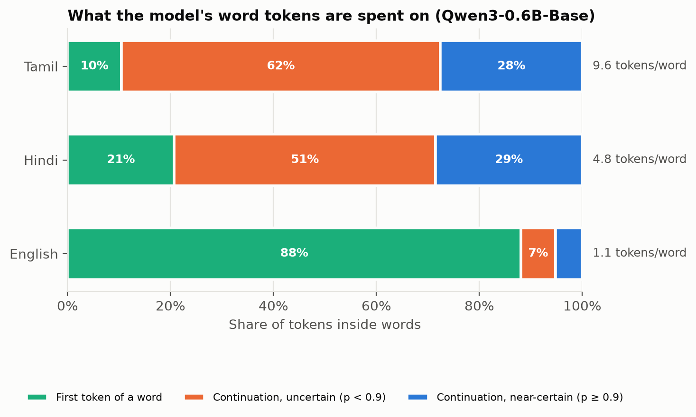
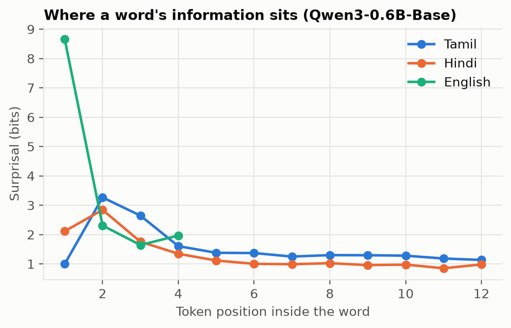
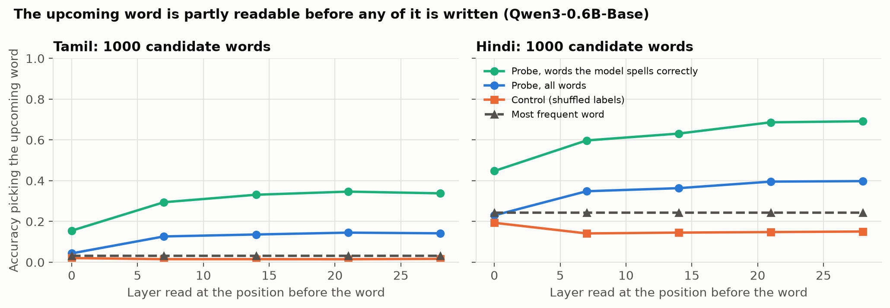
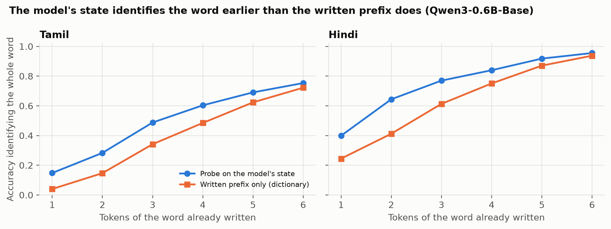
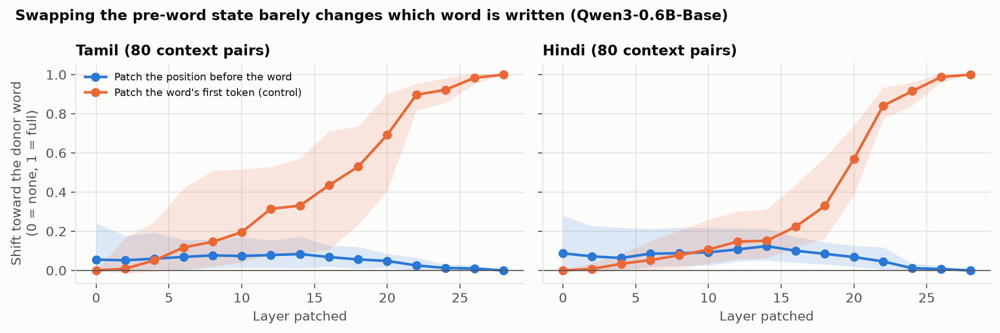
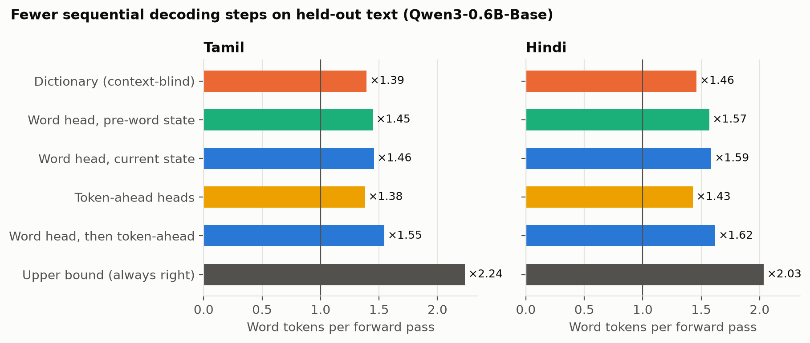

# Results so far

Status on 2026-10-04: full pipeline run on **Qwen3-0.6B-Base** (MacBook M1 Pro, MPS,
float32). The Qwen3-1.7B-Base run is appended to `results_tables.md` when it finishes.
Exact numbers for every table are in [`results_tables.md`](results_tables.md), generated
from `results/` by `experiments/06_report.py`. Console output of each run is in `logs/`.

Data: 1,500 fit and 500 held-out Wikipedia paragraphs per language, 256 tokens each.

## Verdict against the three kill tests

| Kill test (from the proposal) | Bar set in advance | Result on 0.6B | Verdict |
| --- | --- | --- | --- |
| 1. Spelling share | ≥ 40% of Tamil word tokens are near-certain continuations (p ≥ 0.9) | 27.6% at p ≥ 0.9; 46.4% at p ≥ 0.5; 63.1% of continuation tokens are greedy-correct | **Missed** at the stated threshold; real headroom exists (upper bound ×2.24 fewer passes) |
| 2a. Plan probe | Beats majority and shuffled-label control | Tamil 14.5% vs 3.2% / 1.5%; Hindi 39.8% vs 24.4% / 15.1% | **Passed** |
| 2b. Patching | Donor word's later tokens transfer in a clear majority of pairs | Best layer: 6% of Tamil pairs, 6% of Hindi pairs; median effect ≤ 0.12 | **Failed**: no localized plan |
| 3. Decoder | Beat a dictionary drafter; reference point DictSpec's 1.65× | Tamil 1.88 tokens per forward pass vs 1.57 for our dictionary; Hindi 1.66 vs 1.52 | **Modest gain**, lossless on every prompt |

The hypothesis as proposed ("the model commits to a word before writing it and then spells
it out") is only partly right. What the data supports instead is below.

## Finding 1: Indic words cost 5 to 10 tokens, and the first token says almost nothing

- Tamil words take 9.59 tokens on average, Hindi 4.82, English 1.14.
- Only 7.7% of a Tamil word's information is in its first token (Hindi 24.9%, English 94.7%).
  The first token of almost every Tamil word is the same: a space plus the script's shared
  UTF-8 lead bytes.
- 36% of Tamil within-word boundaries fall inside a single UTF-8 character and another 27%
  inside one written syllable. Only 37% are splits between whole graphemes, and those are
  the least predictable (17% near-certain, against 40% for byte splits).

The information of a Tamil word is concentrated in its second and third tokens and then
settles at a little over 1 bit per token for the rest of the word. It never reaches zero,
so most "spelling" tokens still carry a small decision.

## Finding 2: the upcoming word is readable from the model's state before it is written

A linear probe on the last token before a word picks the right word out of 1,000 candidates
14.5% of the time for Tamil (most-frequent-word baseline 3.2%, shuffled-label control 1.5%)
and 39.8% for Hindi (24.4%, 15.1%). On words the model then spells correctly the probe
reaches 34.6% (Tamil) and 69.2% (Hindi), against 12.0% and 17.8% on words it gets wrong.
Readability rises through the first quarter of the network and is then flat.

As the word is written, the model's state stays ahead of what the written prefix gives
away: by 11 to 15 points for the first four Tamil tokens, and by 15 to 23 points for the
first three Hindi tokens. The gap closes by the sixth token.

## Finding 3: that state is necessary for spelling, but it does not decide the word

- **Patching.** Replacing the pre-word state in context B with the one from context A
  (where the model writes a different word) moves the next-token decision at most 8%
  (Tamil) or 12% (Hindi) of the way toward A's word. The control, patching the word's first
  token position, reaches 100% at the last layer.
- **Knockout.** Blocking attention from the word's own positions to the pre-word position
  costs 2.27 bits (Tamil) and 1.84 bits (Hindi) on the word's continuation, and correct
  spelling drops from 63% to 28% and from 85% to 53% (baselines are below 100% because this
  test gives the model only the last 64 tokens of context). Blocking the token before it or a
  random context token costs 0.2 bits or less.

So the pre-word position is a relay the spelling needs, yet its content does not carry the
choice of word. The word is re-derived from many context positions at each step. This is
the opposite of the "plan, then spell" picture, and it explains Finding 4.

## Finding 4: a lossless decoder gets about 1.9 tokens per forward pass on Tamil

Decoder emulation on held-out text (forward passes needed for word tokens):

| Drafter | Tamil | Hindi |
| --- | ---: | ---: |
| Dictionary (context-blind) | ×1.39 | ×1.46 |
| Word head, pre-word state | ×1.45 | ×1.57 |
| Word head, current state | ×1.46 | ×1.59 |
| Token-ahead heads (no lexicon) | ×1.38 | ×1.43 |
| Word head, then token-ahead | **×1.55** | **×1.62** |
| Upper bound (drafter always right) | ×2.24 | ×2.03 |

Real greedy decoding from 12 held-out prompts per language, 64 new tokens each:

| Drafter | Tamil tokens/pass | Tamil wall-clock | Hindi tokens/pass | Hindi wall-clock |
| --- | ---: | ---: | ---: | ---: |
| Plain greedy | 1.00 | ×1.00 | 1.00 | ×1.00 |
| Dictionary | 1.57 | ×1.31 | 1.52 | ×1.46 |
| Word head, current state | 1.71 | ×1.36 | 1.61 | ×1.52 |
| Token-ahead heads | 1.83 | ×1.43 | 1.54 | ×1.42 |
| Word head, then token-ahead | **1.88** | **×1.46** | **1.66** | **×1.55** |

Output was token-for-token identical to plain greedy decoding on all 24 prompts. Fitting
the two heads of the best drafter takes under two minutes per language on the laptop.

Reading the model's state helps, but less than hoped: in the emulation the best
drafter closes about a fifth of the gap between the dictionary and the upper bound for Tamil. Two things limit it.
The head lexicon covers only 39% of held-out Tamil word occurrences (Tamil inflection
produces many rare forms), and the word is not fixed in advance (Finding 3), so a draft
made early in the word is often wrong.

## What this means for the paper

- The cleanest contribution is now the **measurement and mechanism**: byte-level
  tokenizers move almost all of an Indic word's information out of the first token; the
  word is readable but not localized before it is written.
- The **decoder** is a working, lossless, laptop-fittable tool with a modest gain over a
  dictionary. It is not yet a headline result.
- Honest venue estimate at this point: Findings or a workshop (BlackboxNLP) with what is
  here. A main-track case needs a sharper mechanistic result (which heads relay what
  through the pre-word position) and a second model family.

## Limits of these numbers

- One model family and, so far, one size. Gemma is not run.
- 12 prompts per language for real decoding; wall-clock figures are batch-size-1 on MPS and
  include the Python-side drafter overhead. On CPU the same decoder is slower than plain
  decoding.
- 80 context pairs for patching and 300 words for knockout, single seed.
- Greedy decoding only.
- Wikipedia text only; the 2023 dump may overlap the model's training data, which would
  inflate how predictable the text is.
- The prior-work check listed in the proposal (spelling-share measurements, Medusa or
  EAGLE heads on Indic text, shipped multi-token-prediction drafters) has not been done yet.
